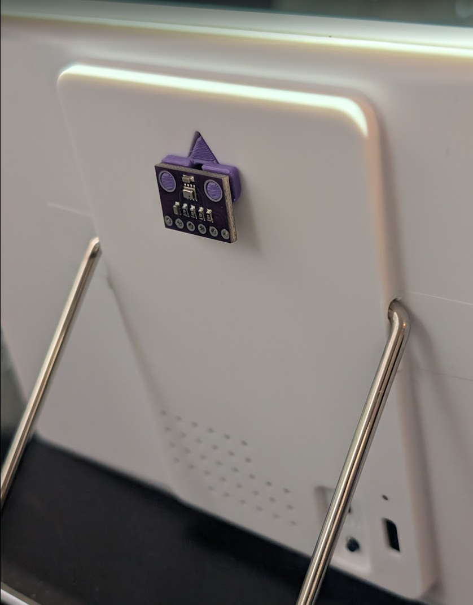
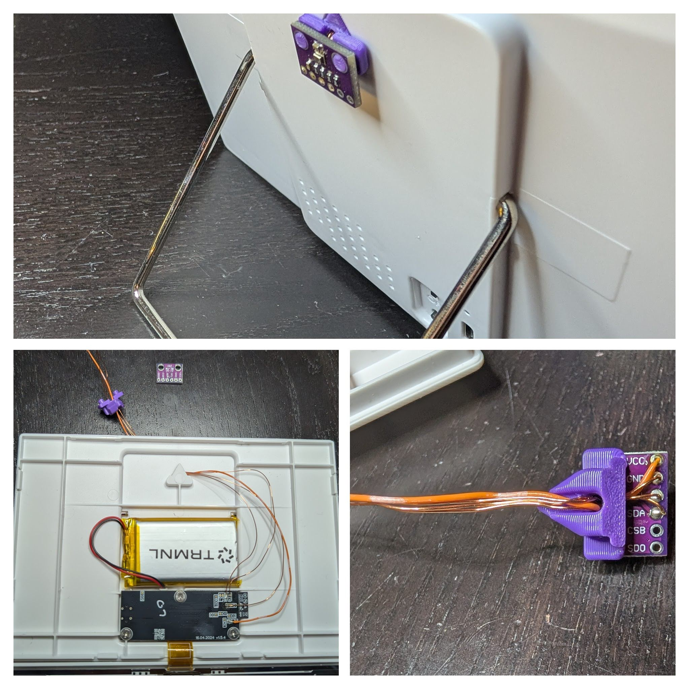

# BMP280 TRMNL Mount

A minimal mount to connect a BMP280 sensor to the Trmnl's rear hanging groove.

Fits in between the Trmnl and the sensor like a lego.

Contains a conduit hole in the mount to allow the sensor to be wired in without making any new holes in the Trmnl case.

## [Download STL](trmnl_bmp280_mount.stl)

## [OnShape Source](https://cad.onshape.com/documents/56fdf90ba29395f948dd02ab/w/676ec03a62e0a8d4939da68d/e/598e816d4fd26a1f95389fe3?renderMode=0&uiState=69c6b696864715a5455c9f0a)
