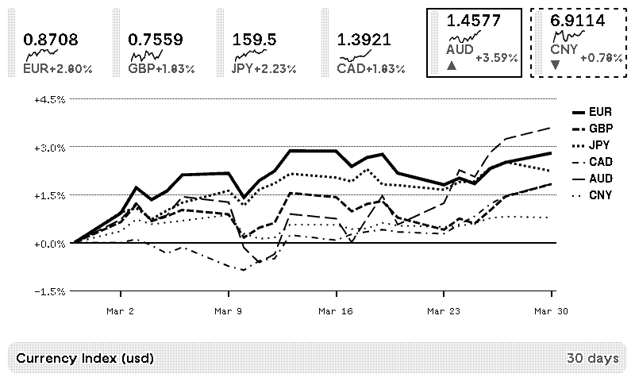

# [Currency Index](https://trmnl.com/recipes/273095?ref=mrlanrat)

Time-series chart of currency exchange rates relative to a base currency, powered by the [Frankfurter API](https://www.frankfurter.app/).

## Description

This plugin displays a historical chart of currency exchange rates over a configurable time period. Track up to 6 currencies relative to your chosen base currency.

## Settings

- **Base Currency**: The reference currency — all others shown relative to this (USD, EUR, GBP, JPY, CHF, CAD, AUD)
- **Currencies to Track**: Comma-separated list of currency codes to display (e.g., EUR,GBP,JPY,CAD,AUD,CNY)
- **Period (Days)**: How many days of history to show (7, 30, 90, 180, or 365)
