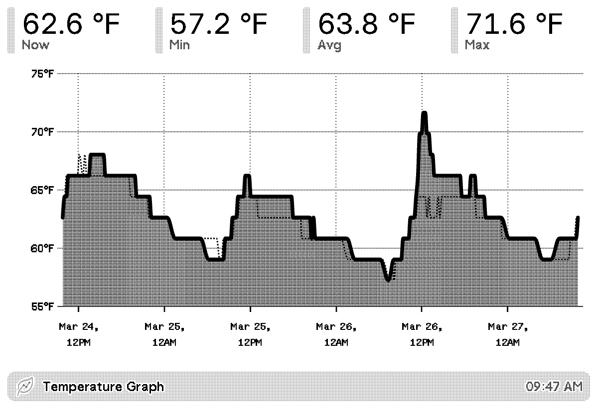

# [Environmental Sensor Graph](https://usetrmnl.com/recipes/256958)

Displays a graph of your selected environmental sensor over a selected period of time on your TRMNL device.

## Description

This plugin graphs data from connected environmental sensors including temperature, humidity, CO₂, and pressure. It shows the current reading along with min, avg, and max stats for the selected period, rendered as a chart. Supports imperial and metric units, and can overlay the prior period for comparison.

## Settings

- **Sensor Type**: Which sensor reading to display (Temperature, Humidity, CO₂, or Pressure)
- **Period (Days)**: Number of days of history to show (1-7)
- **Units**: Unit system for display (Imperial: °F, inHg | Metric: °C, hPa)
- **Show Prior Period?**: Overlay the previous period as a second line for comparison
