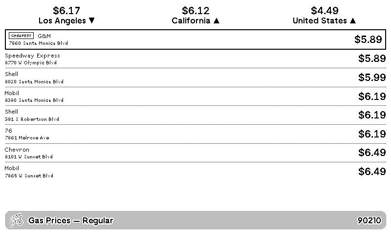

<!-- TODO: add icon.png -->
# [Gas Prices](https://trmnl.com/recipes/273126?ref=mrlanrat)

Nearby gas station prices and area trends via [GasBuddy](https://www.gasbuddy.com/).

## Description

This plugin displays current gas prices for nearby stations and area price trends. Enter a ZIP code or city name to find the cheapest fuel near you.

## Settings

- **ZIP Code or City**: Your ZIP code or city name to search nearby stations (e.g., 90210, Denver CO)
- **Fuel Type**: Which fuel type to display (regular, midgrade, premium, or diesel)
- **Number of Stations**: How many nearby stations to show (5, 8, or 10)
